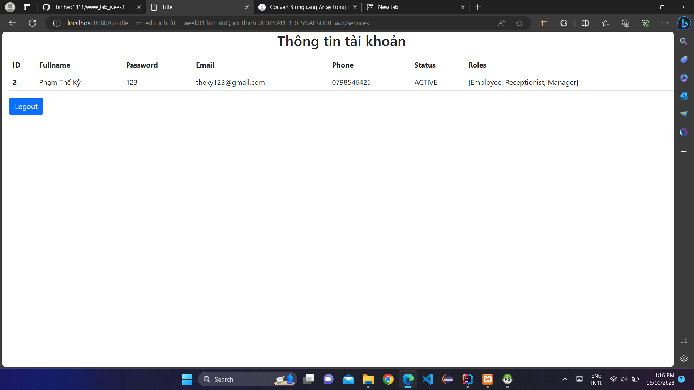
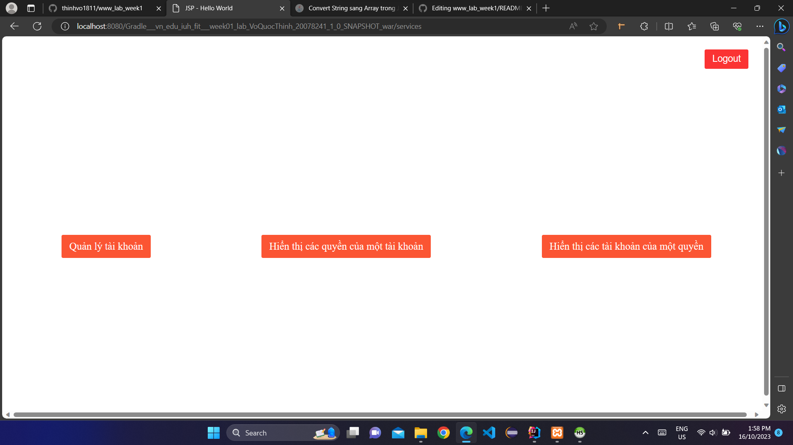
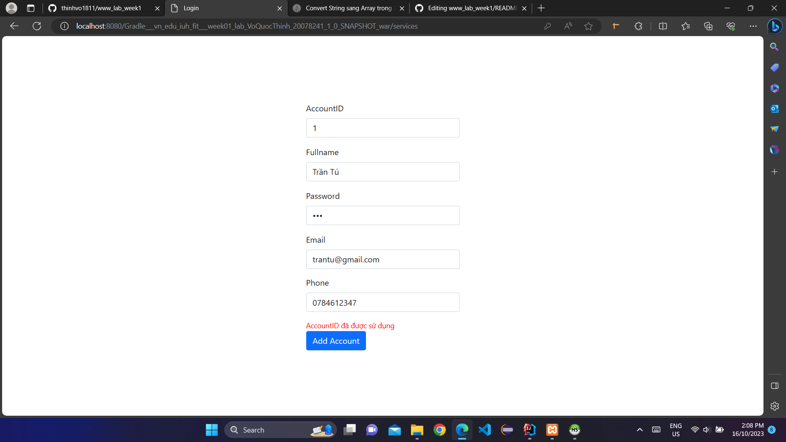
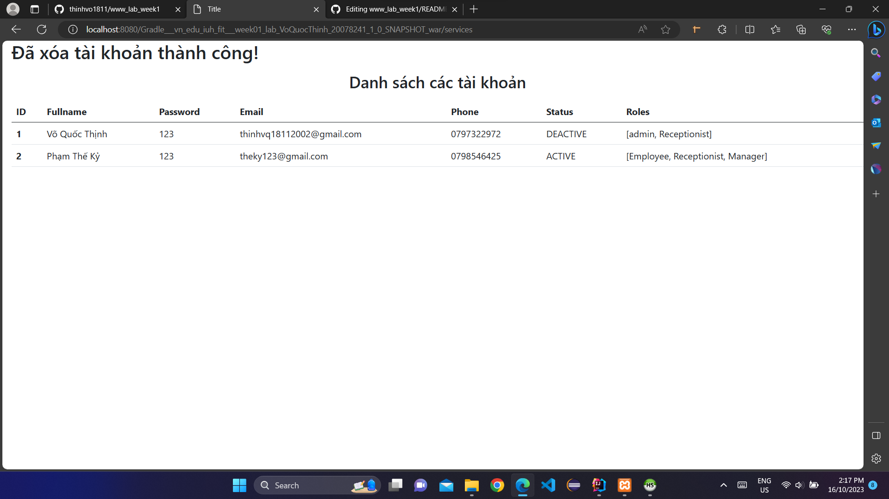
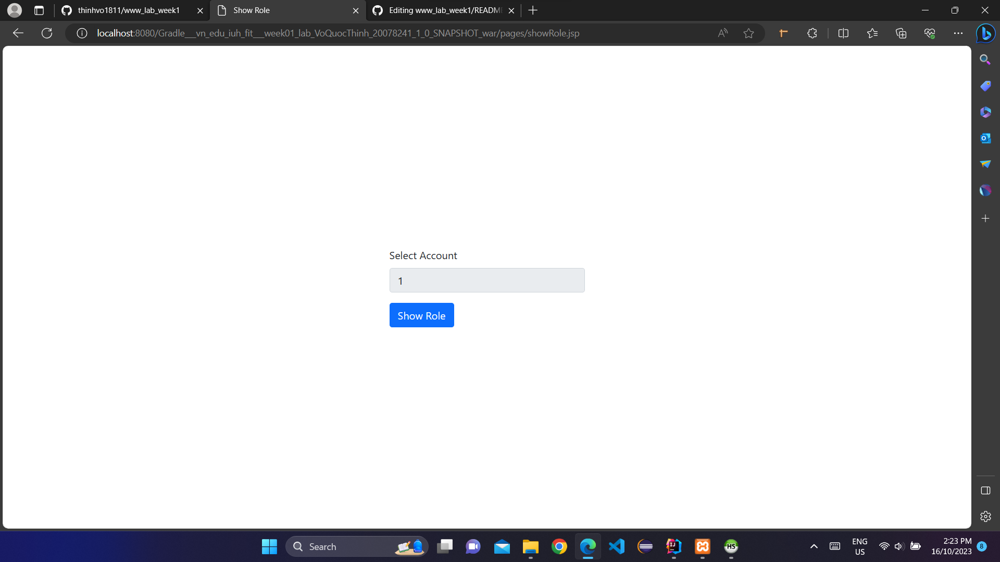
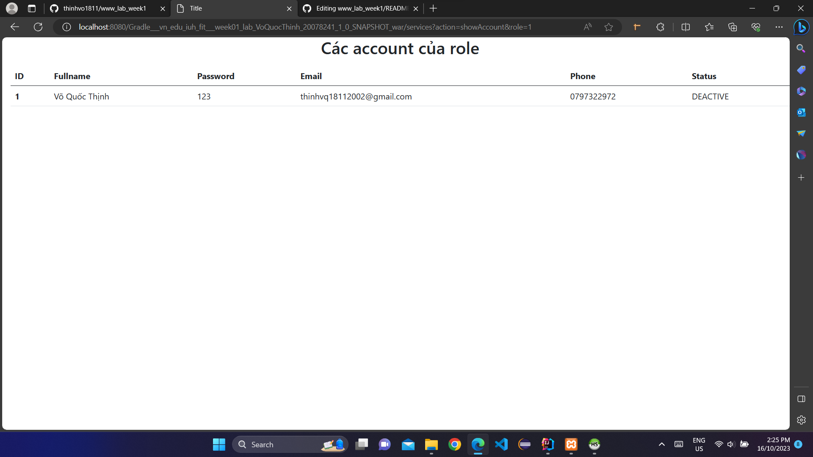

## Giới thiệu:
- ✍ Môn học: Lập trình WWW (Java)
- ✍ Chủ đề: Bài tập tuần 01
 

## Đề bài:

 

## Bài làm:

1. Chức năng đăng nhập
- ✍ Màn hình chính

- ✍ Form đăng nhập

- ✍ Khi đăng nhập không thành công sẽ báo lỗi

- ✍ Khi đăng nhập thành công với tài khoản không có quyền Admin sẽ chỉ hiển thị thông tin người đăng nhập cùng các quyền mà người đó có

- ✍ Khi đăng nhập thành công với tài khoản có quyền Admin sẽ hiển thị các chức năng như quản lý tài khoản, hiển thị các quyền của một tài khoản, hiển thị các tài khoản của một quyền

2. Chức năng quản lý tài khoản

- ✍ Khi chọn chức năng quản lý tài khoản sẽ hiển thị các chức năng như thêm, sửa, xóa, hiển thị danh sách tài khoản và cấp quyền

- ✍ Khi chọn danh sách tài khoản sẽ hiển thị danh sách các tài khoản mà không có status là DELETED

- ✍ Khi chọn chức năng thêm tài khoản thì sẽ hiển thị form cho người dùng điền thông tin

- ✍ Khi thêm tài khoản thì không cho người dùng chọn status mà status mặc định là ACTIVE

- ✍ Khi điền AccountID đã tồn tại thì sẽ báo lỗi

- ✍ Khi điền thông tin hợp lệ thì sẽ hiển thị thông báo thành công và danh sách các tài khoản

- ✍ Khi chọn chức năng sửa tài khoản thì sẽ yêu cầu chọn AccountID muốn sửa (combobox sẽ chỉ hiển thị id của các tài khoản có status không phải là DELETED)

- ✍ Sau đó sẽ hiển thị các thông tin của Account mà được phép sửa (trừ AccountID) 

- ✍ Chỉ cho phép sửa status thành ACTIVE hoặc DEACTIVE 

- ✍ Sau khi sửa thành công sẽ hiển thị thông báo thành công và danh sách các tài khoản

- ✍ Khi chọn chức năng xóa tài khoản thì sẽ yêu cầu chọn AccountID muốn xóa (combobox sẽ chỉ hiển thị id của các tài khoản có status không phải là DELETED)

- ✍ Sau khi xóa thành công sẽ hiển thị thông báo thành công và danh sách các tài khoản (thực chất xóa là cập nhật lại status cho tài khoản đó thành DELETED)

- ✍ Khi chọn chức năng cấp quyền cho một tài khoản thì sẽ yêu cầu chọn RoleID và AccountID muốn cấp 

- ✍ Khi tài khoản này đã tồn tại quyền này thì sẽ thông báo lỗi 

- ✍ Nếu cấp thành công sẽ hiển thị danh sách các GrantAccess 

3. Chức năng hiển thị các quyền của một tài khoản

- ✍ Khi chọn chức năng hiển thị các quyền của một tài khoản thì sẽ yêu cầu chọn AccountID muốn hiển thị các quyền của nó

- ✍ Danh sách các quyền của tài khoản sẽ được hiển thị

4. Chức năng hiển thị các tài khoản của một quyền

- ✍ Khi chọn chức năng hiển thị các tài khoản của một quyền thì sẽ yêu cầu chọn RoleID muốn hiển thị các tài khoản của nó

- ✍ Danh sách các tài khoản của quyền sẽ được hiển thị

5. Chức năng đăng xuất

- ✍ Nếu chọn chức năng đăng xuất thì sẽ trở lại trang màn hình chính và ghi Logout Time vào Log

