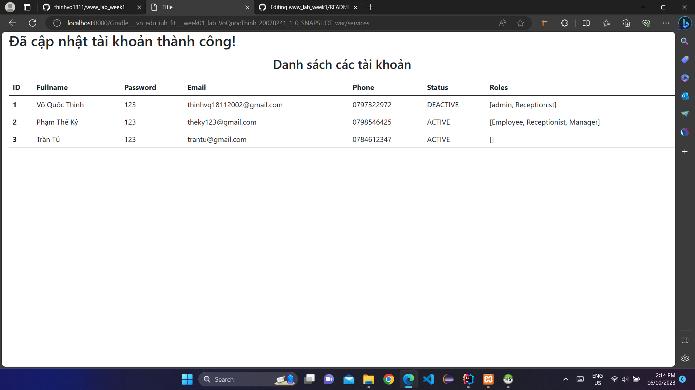
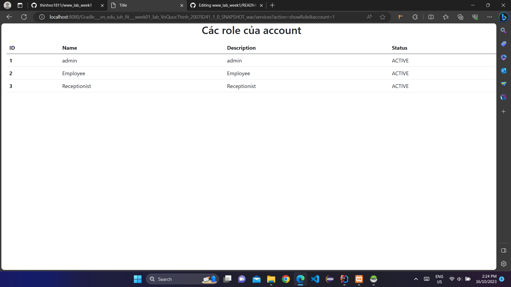
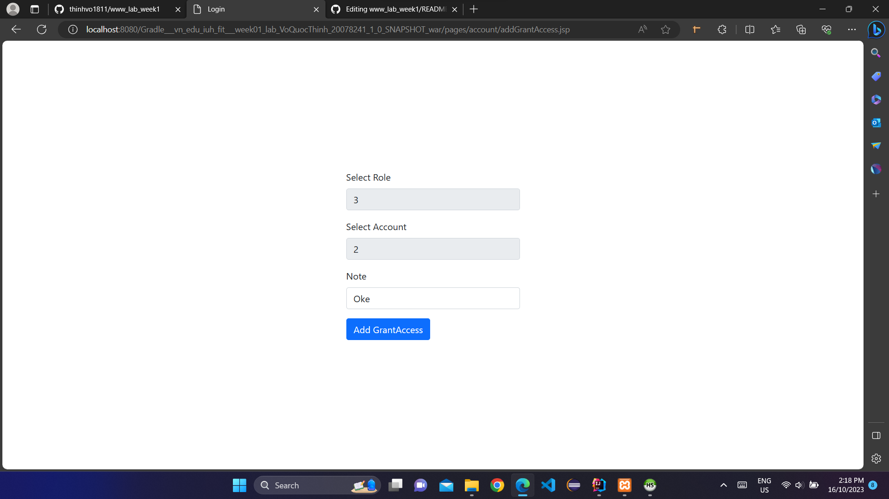
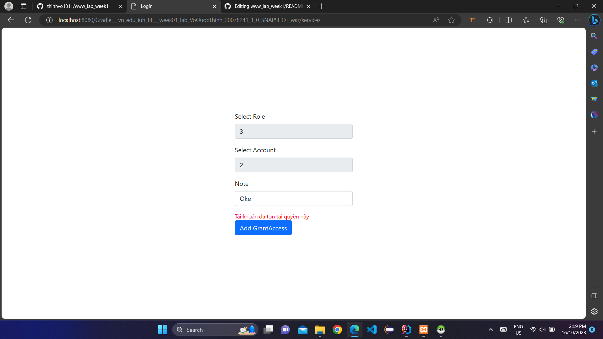

## Giới thiệu:
- ✍ Môn học: Lập trình WWW (Java)
- ✍ Chủ đề: Bài tập tuần 01
 

## Đề bài:

 

## Bài làm:

1. Chức năng đăng nhập
- ✍ Màn hình chính

- ✍ Form đăng nhập

- ✍ Khi đăng nhập không thành công sẽ báo lỗi

- ✍ Khi đăng nhập thành công với tài khoản không có quyền Admin sẽ chỉ hiển thị thông tin người đăng nhập

- ✍ Khi đăng nhập thành công với tài khoản có quyền Admin sẽ hiển các chức năng thêm, xóa, sửa, cấp quyền, xem Role và Account

- ✍ Khi chọn chức năng thêm sẽ hiển thị các bảng muốn thêm

- ✍ Khi chọn thêm Account thì sẽ hiển thị form cho người dùng điền thông tin

- ✍ Khi điền mã Account đã tồn tại thì sẽ báo lỗi

- ✍ Khi điền thông tin hợp lệ thì sẽ hiển thị thông báo thành công và danh sách các Account

- ✍ Các bảng còn lại cũng có thể thực hiện thêm tương tự

- ✍ Tuy việc thêm Log chỉ nên được thực hiện khi đăng nhập, nhưng đề bài yêu cầu thêm tất cả các bảng nên vẫn có chức năng thêm Log riêng

- ✍ Khi chọn chức năng sửa sẽ hiển thị các bảng muốn sửa

- ✍ Khi chọn sửa Account thì sẽ yêu cầu chọn AccountID muốn sửa (combobox sẽ chỉ hiển thị các account có status không phải là DELETED)

- ✍ Sau đó sẽ hiển thị các thông tin của Account mà được phép sửa (trừ AccountID) 

- ✍ Sau khi sửa thành công sẽ hiển thị thông báo thành công và danh sách các Account

- ✍ Các bảng còn tại cũng có thể thực hiện sửa tương tự 

- ✍ Khi chọn chức năng xóa sẽ hiển thị các bảng muốn xóa

- ✍ Khi chọn xóa Account thì sẽ yêu cầu chọn AccountID muốn xóa (combobox sẽ chỉ hiển thị các account có status không phải là DELETED)

- ✍ Sau khi xóa thành công sẽ hiển thị thông báo thành công và danh sách các Account (thực chất xóa là cập nhật lại status cho Account đó thành DELETED)

- ✍ Các bảng còn tại cũng có thể thực hiện xóa tương tự 

- ✍ Khi chọn chức năng hiển thị các Role của một Account thì sẽ yêu cầu chọn AccountID muốn hiển thị các Role của nó

- ✍ Danh sách các Role của Account sẽ được hiển thị

- ✍ Khi chọn chức năng hiển thị các Account của một Role thì sẽ yêu cầu chọn RoleID muốn hiển thị các Account của nó

- ✍ Danh sách các Account của Role sẽ được hiển thị

- ✍ Khi chọn chức năng cấp Role cho một Account thì sẽ yêu cầu chọn RoleID và AccountID muốn cấp 

- ✍ Khi Account này đã được cấp Role này thì sẽ thông báo lỗi 

- ✍ Nếu cấp thành công sẽ hiển thị danh sách các GrantAccess 

- ✍ Nếu chọn chức năng đăng xuất thì sẽ trở lại trang màn hình chính và ghi Logout Time vào Log

